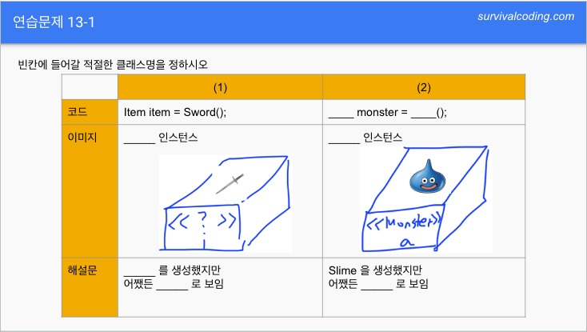

# 연습문제 13-1

||(1) Item|(2) Monster|
|-----|--|-----|
|코드|Item item = Sword();|**Monster** monter = **Slime**();|
|이미지|**Item**인스턴스|**Monster**인스턴스|
|해설문|**Sword**를 생성 했지만 어쨌든 **Item**로 보임|Slime을 생성 했지만 어쨌든 **Monster**로 보임|